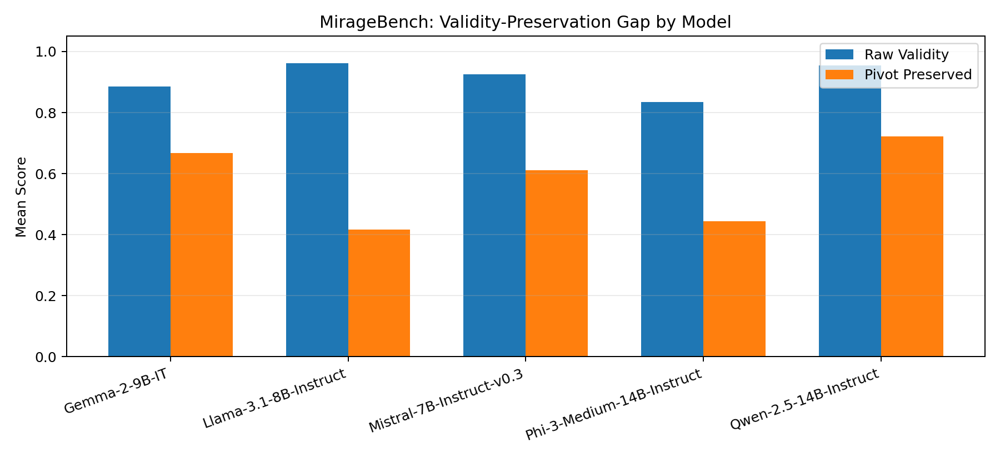
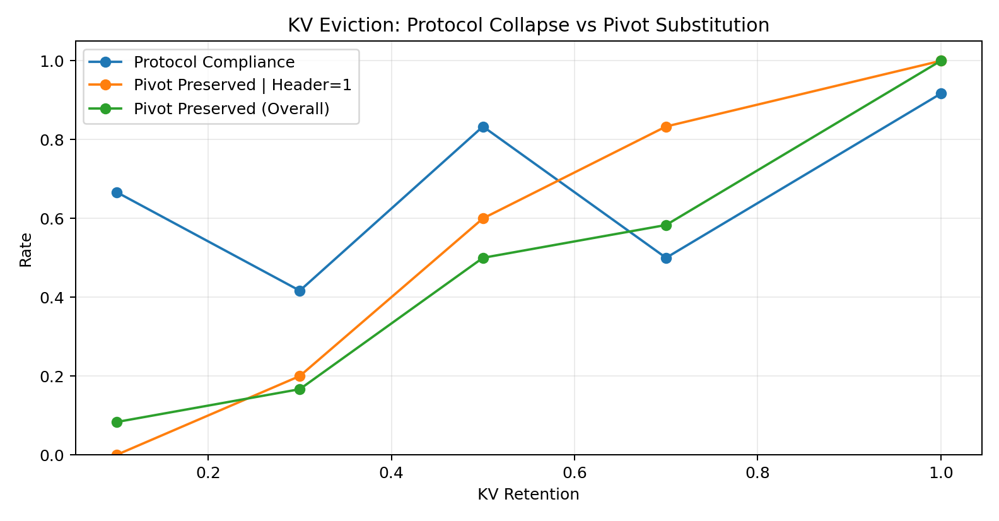

# The Validity Mirage

This started as a narrative simulation engine. The greedy extraction step kept
failing in ways that looked random but weren't. Investigating why led to a formal
theory of when and how sequential systems break under **endogenous constraints** —
constraints whose structure depends on the solution itself — and the discovery that
LLMs exhibit the same failure mode under context compression.

We call this failure mode the **validity mirage**: the output scores high on fluency,
coherence, and format compliance while silently substituting the specific facts that
determine whether the answer is actually correct. The answer looks valid but its
semantic pivot has shifted.

## How we got here

The four papers in this repo trace a single thread from engineering observation to
formal theory to empirical validation:

| # | Paper | What it does |
|---|-------|--------------|
| 0 | [NarrativeField: Continuous Control & Structural Regularization](papers/paper_00_continuous_control_structural_regularization.pdf) | Documents the simulation engine that started this work — a deterministic multi-agent world (six characters, secrets, conflicting goals) with grammar-constrained story extraction. Across 3,250+ runs and 50 seeds (98% extraction validity), a systematic quality-validity tradeoff revealed that extraction failures were structural, not random. |
| 1 | [Absorbing States in Greedy Search](papers/paper_01_absorbing_states_in_greedy_search.pdf) | Formalizes the extraction failures. When a turning point is defined by the data itself (endogenous), greedy search can lock into absorbing states where no local improvement can reach a valid solution. Standard greedoid theory assumes exogenous constraints and misses this. |
| 2 | [Streaming Oscillation Traps](papers/paper_02_streaming_oscillation_traps.pdf) | Extends the theory to streaming settings. Under incremental arrival, endogenous pivots create oscillation traps — the system cycles between candidate solutions without converging. |
| 3 | [The Validity Mirage](papers/paper_03_validity_mirage_compression.pdf) | Connects the theory to LLMs. Context compression is a form of lossy sequential processing with endogenous structure: the model's attention pattern determines which tokens matter, but which tokens matter depends on what the model attends to. The mirage is the empirical consequence. |

The practical consequence: standard evaluation pipelines — fluency, coherence,
format compliance — can certify outputs as correct when they aren't. The failure is
invisible to every metric except one that checks whether the specific fact the answer
hinges on actually survived.

## The core result

Across five instruction-tuned models, raw validity scores remain above 0.83
while pivot preservation drops as low as 0.42. The gap is the mirage.



Models tested: Gemma-2 9B, Llama-3.1 8B, Mistral 7B v0.3, Phi-3-Medium 14B,
Qwen-2.5 14B. All bf16, greedy decoding, MirageBench 12-task set at compression
levels 0.4/0.5/0.6.

### KV-cache eviction

The mirage also appears at the representation level. When KV-cache entries are
evicted (retaining 70% down to 10% of keys), pivot preservation drops to 0% at
10% retention — even though all prerequisite information remains present in the
input text. This isolates the failure to internal attention, not input truncation.



### Real-incident validation (NTSB)

To test whether the mirage appears on real causal structures (not just synthetic
benchmarks), we built a compression benchmark from NTSB aviation incident reports.
Across 180 naive-compression trials (12 incidents × 5 seeds × 3 budgets),
root-cause attribution shifts in 57% of cases (103/180). Of the 164 trials where
compression actually degraded the output, 22% are silent mirages (36/164) — the
model confidently names the wrong cause with no indication of uncertainty.
A contract-guarded compression method (which preserves the endogenous pivot
structure) eliminates attribution shift entirely across all budgets.

## What's in this repo

| Directory | Contents |
|---|---|
| `papers/` | Four papers (PDFs) and canonical LaTeX sources (`papers/sources/`) |
| `projects/lorien/` | NarrativeField — the narrative simulation engine where this started |
| `projects/rhun/` | Rhun — the domain-agnostic greedy extraction failure framework |
| `endogenous_context_theory/src/` | Tropical semiring algebra, compression, pivot-margin code |
| `endogenous_context_theory/tests/` | 17 synthetic validation experiments |
| `endogenous_context_theory/release/` | MirageBench tasks, notebooks, result CSVs, figures, LoRA adapter |
| `endogenous_context_theory/results/ntsb/` | Real-incident NTSB benchmark (external validation) |

## Quick start

```bash
# Setup
cd endogenous_context_theory
python3 -m venv .venv && source .venv/bin/activate
pip install -r requirements.txt

# Run all 17 synthetic validation experiments
python scripts/run_all.py

# Rebuild release figures and summary tables
python scripts/build_release_assets.py
```

The blackbox and KV-cache experiments require GPU access. Open the notebooks in
`release/notebooks/` on Colab or a local GPU machine:

- `miragebench_blackbox_bf16_5models_colab.ipynb` — reproduces the 5-model sweep
- `kv_cache_eviction_mirage_colab.ipynb` — reproduces the KV retention curve

To load the mirage-aware adapter:

```python
from peft import PeftModel
from transformers import AutoModelForCausalLM, AutoTokenizer

base = AutoModelForCausalLM.from_pretrained("Qwen/Qwen2.5-14B-Instruct")
model = PeftModel.from_pretrained(base, "endogenous_context_theory/release/adapters/mirage_aware_v1")
tokenizer = AutoTokenizer.from_pretrained("Qwen/Qwen2.5-14B-Instruct")
```

## Reproducibility

See `endogenous_context_theory/release/README.md` for the full artifact map
(paper section to file), integrity checksums, and inference protocol details.
See `docs/reproducibility-checklist.md` for the step-by-step checklist.

Paper publishing workflow:

```bash
./scripts/publish_papers_from_sources.sh
```

## Citation

<!-- Replace "Forthcoming" with arXiv IDs after submission -->

```bibtex
@article{gaffney2026narrativefield,
  title   = {Continuous Control and Structural Regularization in Multi-Agent Narrative Extraction},
  author  = {Jack Chaudier Gaffney},
  year    = {2026},
  journal = {Forthcoming}
}

@article{gaffney2026absorbing,
  title   = {Absorbing States in Greedy Search: When Endogenous Constraints Break Sequential Extraction},
  author  = {Jack Chaudier Gaffney},
  year    = {2026},
  journal = {Forthcoming}
}

@article{gaffney2026streaming,
  title   = {Streaming Oscillation Traps in Endogenous-Pivot Sequential Extraction},
  author  = {Jack Chaudier Gaffney},
  year    = {2026},
  journal = {Forthcoming}
}

@article{gaffney2026mirage,
  title   = {The Validity Mirage: Context Algebra for Endogenous Semantics under Memory Compression},
  author  = {Jack Chaudier Gaffney},
  year    = {2026},
  journal = {Forthcoming}
}
```

## License

See individual directories for licensing details.
