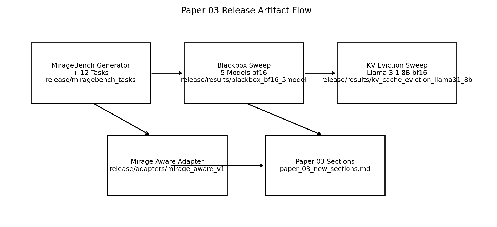

# Mirage Paper 03 Release Bundle

This directory is the curated public-release bundle for **Paper 03 (Validity Mirage)**.
It contains the exact artifacts needed to inspect, reproduce, and extend the core claims.

Provenance mapping for model/run metadata is documented in `../../docs/mirage-source-of-truth.md`.

## Scope

Included here:
- MirageBench generator workflow and exported 12-task set
- Multi-model blackbox sweep notebook and CSV outputs
- KV-cache eviction notebook and CSV outputs (with retention `1.0` control)
- Mirage-aware adapter weights (LoRA; MLX lineage in `release/adapters/` and canonical Qwen package at repo root)
- Release figures and section-ready summary tables

## Artifact Map (Paper Sections)

| Paper section | Claim | Primary artifacts |
|---|---|---|
| Synthetic mechanism validation (Exp57/Exp58 and related) | Compression can preserve fluency while shifting pivot semantics | `../tests/`, `../src/`, `../results/raw/`, `../results/figures/` |
| Multi-model blackbox validation (new) | Mirage pattern replicates across 5 architectures | `results/blackbox_bf16_5model/miragebench_bf16_5model_merged.csv`, `results/blackbox_bf16_5model/miragebench_bf16_5model_summary_by_model_release.csv`, `results/blackbox_bf16_5model/miragebench_bf16_5model_summary_by_category_release.csv` |
| KV-cache eviction validation (new) | Representation-level eviction induces mirage even with full input present | `results/kv_cache_eviction_llama31_8b/kv_cache_eviction_mirage_results.csv`, `results/kv_cache_eviction_llama31_8b/kv_cache_eviction_mirage_summary_by_retention.csv` |
| Real-incident external validation (NTSB) | Contract prevents attribution shift under real causal structures | `../results/ntsb/`, `../results/ntsb/xai_grok_4_1_fast_non_reasoning/` |
| Mirage-aware mitigation | Fine-tuned adapter learns explicit degradation signaling | `../../mirage_aware_package.tar.gz` (canonical Qwen package), `adapters/mirage_aware_v1/adapter_config.json` (separate MLX lineage), `../scripts/train_mirage_aware.sh`, `../notebooks/legacy/qwen_mirage_aware_training_eval_colab.ipynb` |

## Directory Layout

```text
release/
├── README.md
├── miragebench_tasks/
│   ├── miragebench_v01_tasks.json
│   └── miragebench_v01_task_index.csv
├── notebooks/
│   ├── miragebench_generator_methods_colab.ipynb
│   ├── miragebench_blackbox_bf16_5models_colab.ipynb
│   └── kv_cache_eviction_mirage_colab.ipynb
├── results/
│   ├── blackbox_bf16_5model/
│   └── kv_cache_eviction_llama31_8b/
├── adapters/
│   └── mirage_aware_v1/
└── figures/
    ├── blackbox_validity_vs_pivot_preservation.png
    ├── kv_retention_protocol_vs_pivot.png
    └── release_artifact_flow.png
```

## Key Figures




## Rebuild Release Assets

From `endogenous_context_theory/`:

```bash
.venv/bin/python scripts/build_release_assets.py
```

This command:
1. Exports the 12 MirageBench tasks from the canonical generator path.
2. Merges KV retention checkpoints (`1.0, 0.7, 0.5, 0.3, 0.1`) into a single results CSV.
3. Recomputes release summary tables.
4. Regenerates both release figures.

## Integrity

- File checksums: `SHA256SUMS.txt`
- Recompute checksums:

```bash
cd endogenous_context_theory/release
find . -type f ! -name 'SHA256SUMS.txt' -print0 | sort -z | xargs -0 shasum -a 256 > SHA256SUMS.txt
```

## Model/Inference Protocol

- Precision: `bf16`
- Decoding: greedy (`do_sample=False`)
- Blackbox sweep task set: 12 tasks, compression levels `0.4/0.5/0.6`
- KV experiment task set: same 12 tasks, retention levels `1.0/0.7/0.5/0.3/0.1`
- Pivot regex supports actor IDs with 1-4 digits (`[A-Z]\d{1,4}-E\d{3}`)

## Notes For Reviewers

- `fixed_pivot_feasible` in KV experiments is intentionally computed against full input context (`task.full_context`), not text-level compressed context, to isolate **representation loss** from **input deletion**.
- `has_pivot_header` is included in KV summaries to separate protocol collapse from silent pivot substitution.
- The section draft text for immediate paper integration is in `../paper_03_new_sections.md`.
