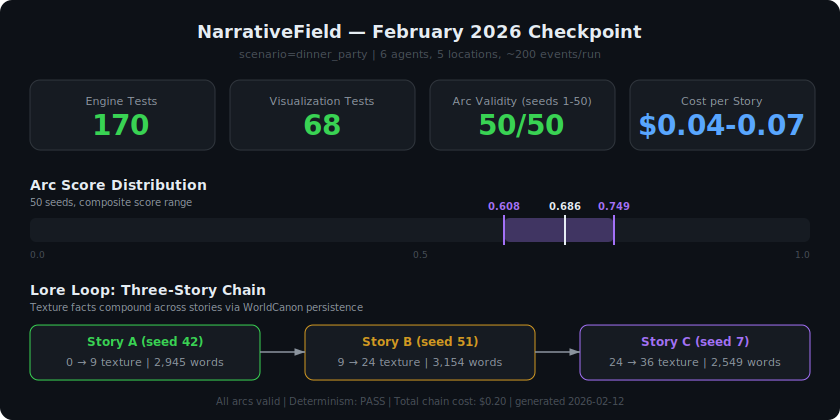
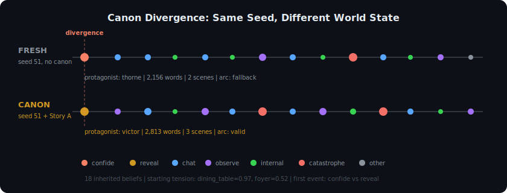
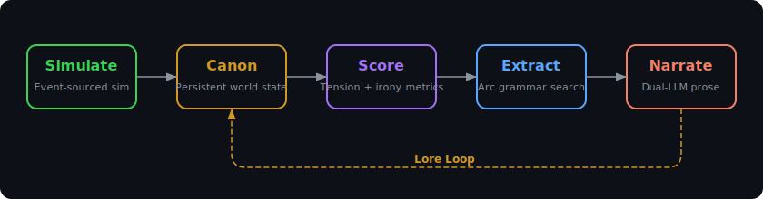
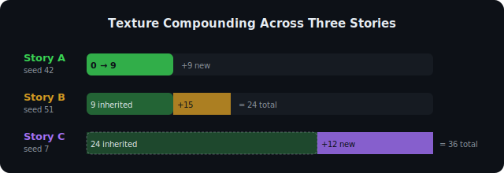

# NarrativeField

**Don't write the story. Simulate the world. Extract the stories that emerge.**

NarrativeField is a simulation-first storytelling engine. Instead of prompting an LLM to write fiction, it runs a deterministic multi-agent simulation — six characters with secrets, debts, and conflicting goals collide over a dinner party — then scores narrative tension mathematically, extracts the most dramatic arcs via grammar-constrained search, and generates multi-scene literary prose for about **$0.06 per story**.

The simulation is the ground truth. The prose is a downstream projection.

## What Makes This Different

**Simulation truth, not hallucination.** Every event in the story actually happened in the simulation. Characters don't spontaneously develop new motivations because a language model drifted — they act on goals, secrets, and beliefs tracked in a deterministic event log. The same seed always produces the same story. Run it twice, diff the output, get nothing.

**Canon persistence.** WorldCanon materializes a persistent view of the simulation — location memory (where catastrophes happened), belief snapshots (who knows what), entity registries. Save Story A's canon, load it into Story B: 18 inherited beliefs shift, location tension residue carries over, and the simulation diverges from event zero. Same seed, different world state, different story.

**Canon decay and goal evolution.** Chaining stories with persistent canon creates a problem: secrets get resolved, alliances settle, and the dramatic fuel that powered earlier stories is consumed. Tension residue and belief confidence decay exponentially between episodes, but the real fix is coordinated goal evolution — updating all six agents' motivations to reflect what happened. Single-agent evolution degrades quality; coordinated evolution closes 89% of the gap between degraded and fresh simulations.

**The lore loop.** When the narrator generates prose, it invents texture — a character's portfolio name, a specific wine vintage, a throwaway detail that makes the scene feel real. Those invented details are captured as texture facts and committed back to canon. The next story inherits them. Over three stories, texture compounds from 0 to 36 facts, and the storyworld accumulates the kind of lived-in detail that usually requires a human author's memory.

## Evidence

| Metric | Value | Source |
|--------|-------|--------|
| Engine tests | 177 passing | `pytest -q` |
| Visualization tests | 68 passing | `vitest run` |
| Arc validity (seeds 1–50) | **50/50** (100%) | `arc_sweep_20260212T042854Z.json` |
| Arc score range | 0.608–0.749, median 0.686 | same sweep |
| Cost per story | $0.04–0.07 | production validation (6 seeds) |
| Three-story texture chain | 0 → 9 → 24 → 36 facts | `lore_loop_chain_summary.txt` |
| Rashomon extraction validity | **294/300** (98%) across 50 seeds | `rashomon_sweep_*.json` |
| Chain degradation baseline | 0.696 → 0.637 over 5 positions | 4 independent orderings |
| Goal evolution recovery | **89%** of quality gap closed | seed 7, all conditions at $0.00 |
| Determinism | PASS (12 seeds) | checkpoint science data |



## Research: Chain Degradation and Goal Evolution

When stories share persistent world state, a chain degradation problem emerges: secrets resolve, alliances settle, and arc quality declines from 0.696 to 0.637 over five episodes. The root cause is information depletion — after two stories, 57% of agent-belief pairs are fully resolved, leaving nothing to reveal.

A controlled perturbation experiment shows that structurally central beliefs produce 16x the quality impact of peripheral controls, confirming that the simulation's decision engine is causally sensitive to belief content. Coordinated goal evolution — updating all six agents' motivations to reflect narrative consequences — closes 89% of the quality gap between degraded and fresh simulations. The recovery exhibits a collective threshold: evolving one agent *degrades* quality, while evolving all six approaches the fresh ceiling.

All experiments run deterministically at **$0.00 LLM cost** with full reproducibility from fixed random seeds.

See [`paper/goal_evolution_paper.pdf`](paper/goal_evolution_paper.pdf) for the full paper.

A second paper ([`paper/paper2.pdf`](paper/paper2.pdf)) on continuous control, structural regularization, and extraction failure mechanisms extends the analysis to 50 seeds and 3,250 runs, identifying a quality-validity tradeoff and characterizing the beat grammar as a structural regularizer against metric exploitation.

## The Canon Test

The strongest evidence for simulation-first storytelling is the canon test: run the same seed with and without inherited world state.

| | Fresh (no canon) | Canon (with Story A) |
|---|---|---|
| **Seed** | 51 | 51 |
| **Protagonist** | thorne | victor |
| **Words** | 2,156 | 2,813 |
| **Scenes** | 2 | 3 |
| **Arc valid** | no (fallback) | **yes** |
| **Cost** | $0.040 | $0.060 |

The fresh run fails arc validation and falls back to a ranked vignette. The canon-loaded run — same seed, same agents, same scenario — produces a valid three-act arc with a different protagonist. This isn't cherry-picked: the fresh failure *is the point*. Canon state provides the narrative pressure that makes arcs cohere.



## Architecture



**Simulate** — Six characters with goals, secrets, beliefs, and flaws move through five locations with privacy and overhear rules. A seeded RNG produces a deterministic event log of ~200 events. Pacing physics (dramatic budget, stress, composure, hysteresis) regulate escalation.

**Canon** — WorldCanon materializes persistent state from the event stream: location memory with tension residue, claim-state snapshots, and entity registries. Canon state can be saved and loaded across runs. Between episodes, exponential decay attenuates tension residue and belief confidence to prevent information saturation.

**Score** — A metrics pipeline computes tension (eight sub-metrics aggregated into a scalar field), tracks dramatic irony via a belief matrix, and scores event significance. Events are grouped into scenes using boundary detection.

**Extract** — Rashomon extraction pulls one arc per protagonist from the same event log — six perspectives on the same dinner party. Arc grammars (hard structural constraints) and soft scoring select protagonist-centric arcs with escalation, turning points, and consequences. Output is a structured beat sheet.

**Narrate** — A dual-LLM strategy generates prose: Claude Haiku for creative writing, Grok for structural tasks. The narrator receives a lorebook with world definition, character backstories, and secrets. Texture facts extracted from prose feed back into canon via the lore loop.



## Quick Start

### Explore the Visualization (no API keys needed)

```bash
cd src/visualization
npm install
npm run dev
```

Loads `data/fake-dinner-party.nf-viz.json` by default. Load any `.nf-viz.json` via the Control Panel.

### Generate a Story

```bash
cd src/engine
pip install -e ".[dev]"
pip install openai

ANTHROPIC_API_KEY=... XAI_API_KEY=... \
  python -m scripts.test_live_generation --live --seed 42
```

### Run the Lore Loop Demo

```bash
cd src/engine
ANTHROPIC_API_KEY=... XAI_API_KEY=... \
  python -m scripts.demo_lore_loop
```

Chains three stories (A→B→C) with texture compounding. Takes ~8 minutes, costs ~$0.20.

### Run Rashomon Extraction + Wound Analysis

```bash
cd src/engine
python -m scripts.sweep_rashomon --seed-from 1 --seed-to 50 --output scripts/output/rashomon_sweep_1_50.json
python -m scripts.analyze_wounds --input scripts/output/rashomon_sweep_1_50.json --output scripts/output/wound_analysis_1_50.json --threshold 0.25
```

Extracts one arc per protagonist per seed, reports overlap/turning-point diagnostics, then mines recurring turning-point and escalation patterns.

### Run the Research Experiments (no API keys needed)

```bash
cd src/engine

# Chain degradation across 4 orderings of 5 seeds
python -m scripts.research_chain --seeds 42,51,7,13,29 --skip-narration

# Belief-state perturbation (16x sensitivity ratio)
python -m scripts.test_epiphany_bypass

# Goal evolution (89% recovery, collective threshold)
python -m scripts.test_goal_evolution
```

All experiments run deterministically at $0.00 LLM cost.

## Project Structure

```text
lorien/
├── docs/                  # Architecture docs and design history
│   ├── ARCHITECTURE.md    # Full technical deep dive
│   ├── design_v1-v3.md    # Design evolution (v3 is canonical)
│   ├── checkpoints/       # Phase checkpoint reports
│   └── audits/            # Subsystem audit reports
├── paper/                 # Research paper on chain degradation + goal evolution
├── specs/                 # 17 engineering specifications (read-only)
├── src/
│   ├── engine/            # Python — simulation, metrics, extraction, narration
│   └── visualization/     # TypeScript + React — interactive explorer
├── data/                  # Simulation and visualization data bundles
├── examples/              # Story outputs with generation metadata
└── CHANGELOG.md
```

## Sample Output

> The table was set with white plates that caught the light — too bright, Diana thought, and immediately wondered why she was cataloguing details. The kind of thinking that came when you were paying attention to anything but what mattered.
>
> "So tell me," Victor said, and the phrasing — so casual, so knowing — made Diana's forearms go tense. "What's the actual state of things with the foundation audit? I've been hearing rumblings."
>
> Thorne smiled. It was the kind of smile he used in client meetings. "Rumblings from whom?"
>
> Victor was quiet for a moment. Just drinking. The silence accumulated weight.

From `examples/story_b_canon_seed51.txt` — generated from a canon-loaded simulation run, seed 51, protagonist Victor. 2,813 words, 3 scenes, $0.06.

## Development

```bash
# Tests
cd src/engine && pytest
cd src/visualization && npm test

# Linting
cd src/engine && ruff check .
cd src/visualization && npx eslint src/
```

## Current Status

The simulation, metrics, extraction, and narration pipelines are working end-to-end. Arc validity is 100% across 50 seeds for single-protagonist extraction, and Rashomon extraction now supports all six protagonists per run with overlap diagnostics. The lore loop demonstrates multi-story texture compounding. The interactive visualization renders thread views and narrative topology. A research paper on chain degradation and coordinated goal evolution documents the findings from controlled experiments across the pipeline.

See [`docs/ARCHITECTURE.md`](docs/ARCHITECTURE.md) for the full technical deep dive, [`AGENTS.md`](AGENTS.md) for contributor guidance, and [`paper/`](paper/) for the research paper.
