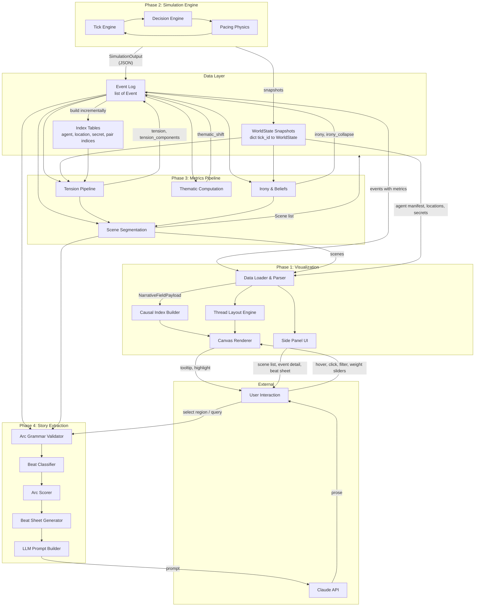

# Data Flow and Interface Contracts

> **Spec:** `specs/integration/data-flow.md`
> **Owner:** metrics-architect
> **Status:** Draft
> **Depends on:** `specs/schema/events.md` (#1), `specs/schema/agents.md` (#2), `specs/visualization/renderer-architecture.md` (#9), `specs/metrics/tension-pipeline.md` (#13)
> **Blocks:** `specs/MASTER_PLAN.md` (#18)
> **Doc3 decisions:** #1 (event-primary graph), #2 (CQRS read layer), #16 (first-class scenes)

---

## 1. Overview

This spec defines the interface contracts between ALL subsystems in NarrativeField. It specifies the exact data shapes that flow between the simulation engine, the metrics pipeline, the visualization renderer, and the story extraction system.

Every subsystem reads from and writes to well-defined interfaces. No subsystem reaches into another's internals.

---

## 2. System Architecture Diagram



---

## 3. Interface Contracts

### 3.1 SimulationOutput -> EventLog

The simulation engine produces a JSON file containing the complete event log and supporting data.

**Producer:** Simulation Engine (tick-loop.md, decision-engine.md, pacing-physics.md)
**Consumer:** Metrics Pipeline, Data Loader

```typescript
/**
 * The raw output of a simulation run, written to disk as JSON.
 * This is the source-of-truth artifact (Decision #1).
 */
interface SimulationOutput {
  /** Simulation metadata */
  metadata: SimulationMetadata;

  /** Initial world state (tick 0 snapshot) */
  initial_state: WorldStateSnapshot;

  /** Periodic snapshots for CQRS replay (Decision #2) */
  snapshots: WorldStateSnapshot[];

  /** The event log: ordered list of all events */
  events: RawEvent[];

  /** Secret definitions (ground truth) */
  secrets: SecretDefinition[];

  /** Location definitions */
  locations: LocationDefinition[];
}

interface SimulationMetadata {
  simulation_id: string;
  scenario: string;                  // "dinner_party"
  total_ticks: number;
  total_sim_time: number;            // minutes
  agent_count: number;
  event_count: number;
  snapshot_interval: number;         // events between snapshots (default 20)
  timestamp: string;                 // ISO 8601 creation time
}

interface WorldStateSnapshot {
  tick_id: number;
  sim_time: number;
  agents: Record<string, AgentState>;    // agent_id -> full AgentState
  global_tension: number;
}

/**
 * RawEvent is the Event schema from events.md, but with
 * metrics fields at their default (zero) values.
 * The metrics pipeline fills them in.
 */
type RawEvent = Event;  // metrics fields are all 0.0 / empty

interface SecretDefinition {
  id: string;
  holder: string[];                  // Agent(s) who hold primary knowledge (matches world.md)
  about: string | null;
  content_type: string;
  description: string;
  truth_value: boolean;
  initial_knowers: string[];         // Agent IDs who start knowing this secret
  initial_suspecters: string[];      // Agent IDs who start suspecting
  dramatic_weight: number;           // [0.0, 1.0] — importance weight for metrics
  reveal_consequences: string;       // What happens if this secret becomes public
}

interface LocationDefinition {
  id: string;
  name: string;
  description: string;               // Human-readable description for tooltips
  privacy: number;                   // [0.0, 1.0]
  capacity: number;
  adjacent: string[];
  overhear_from: string[];
  overhear_probability: number;      // [0.0, 1.0] — probability of overhearing from adjacent locations
}
```

**JSON file example (abbreviated):**

```json
{
  "metadata": {
    "simulation_id": "sim_001",
    "scenario": "dinner_party",
    "total_ticks": 130,
    "total_sim_time": 195.0,
    "agent_count": 6,
    "event_count": 142,
    "snapshot_interval": 20,
    "timestamp": "2026-02-06T14:30:00Z"
  },
  "initial_state": {
    "tick_id": 0,
    "sim_time": 0.0,
    "agents": { "thorne": { "...": "..." } },
    "global_tension": 0.0
  },
  "snapshots": [
    { "tick_id": 20, "sim_time": 30.0, "agents": {}, "global_tension": 0.12 }
  ],
  "events": [
    { "id": "evt_0001", "sim_time": 1.5, "...": "..." }
  ],
  "secrets": [
    { "id": "secret_affair_01", "holder": ["elena"], "about": "elena", "content_type": "affair", "description": "Elena and Marcus are having an affair", "truth_value": true }
  ],
  "locations": [
    { "id": "dining_table", "name": "Dining Table", "privacy": 0.1, "capacity": 8, "adjacent": ["kitchen", "foyer", "balcony"], "overhear_from": ["kitchen"] }
  ]
}
```

### 3.2 EventLog -> MetricsPipeline

The metrics pipeline reads the SimulationOutput and enriches each event's `metrics` dict.

**Producer:** Metrics Pipeline (tension-pipeline.md, irony-and-beliefs.md, scene-segmentation.md)
**Consumer:** Renderer (via NarrativeFieldPayload), Story Extraction

**Input:** `SimulationOutput` (events with zero metrics)
**Output:** Mutated events with populated metrics + `Scene[]`

```python
def run_metrics_pipeline(sim_output: SimulationOutput) -> MetricsPipelineOutput:
    """
    Full metrics pipeline execution.
    Modifies events in place and produces scene list.

    Execution order matters:
    1. Irony computation (needed by tension's irony_density sub-metric)
    2. Thematic shift computation
    3. Tension pipeline (uses irony values)
    4. Scene segmentation (uses tension values and irony collapse)
    """
    events = sim_output.events
    snapshots = {s.tick_id: s for s in sim_output.snapshots}
    snapshots[0] = sim_output.initial_state
    secrets = {s.id: s for s in sim_output.secrets}
    index_tables = build_index_tables(events)

    # Step 1: Compute irony for every event
    run_irony_pipeline(events, snapshots, secrets)

    # Step 2: Compute thematic shifts
    run_thematic_pipeline(events, snapshots)

    # Step 3: Compute tension (reads irony values from step 1)
    run_tension_pipeline(events, snapshots, secrets, DEFAULT_WEIGHTS, index_tables)

    # Step 4: Segment into scenes (reads tension from step 3)
    scenes = segment_into_scenes(events, snapshots, DEFAULT_SEGMENTATION_CONFIG)

    return MetricsPipelineOutput(
        events=events,           # now with populated metrics
        scenes=scenes,
        belief_snapshots=extract_belief_snapshots(snapshots),
    )
```

**MetricsPipelineOutput:**

```python
@dataclass
class MetricsPipelineOutput:
    events: list[Event]              # events with metrics populated
    scenes: list[Scene]              # scene segmentation result
    belief_snapshots: list[BeliefSnapshot]  # periodic belief matrices for tooltips
```

**Per-event metrics after pipeline (JSON):**

```json
{
  "tension": 0.58,
  "tension_components": {
    "danger": 0.80,
    "time_pressure": 0.15,
    "goal_frustration": 0.70,
    "relationship_volatility": 0.80,
    "information_gap": 0.50,
    "resource_scarcity": 0.55,
    "moral_cost": 0.45,
    "irony_density": 0.40
  },
  "irony": 2.4,
  "irony_collapse": null,
  "significance": 0.0,
  "thematic_shift": {
    "loyalty_betrayal": -0.25,
    "truth_deception": 0.1
  }
}
```

### 3.3 EventLog + Metrics -> RendererInput (NarrativeFieldPayload)

The renderer loads a single JSON payload that contains everything needed for visualization.

**Producer:** Bundler (post-metrics-pipeline packaging step)
**Consumer:** Visualization Data Loader (renderer-architecture.md Section 2)

```typescript
/**
 * The top-level JSON structure loaded by the renderer.
 * Produced by bundling SimulationOutput + MetricsPipelineOutput.
 *
 * This resolves the open question in renderer-architecture.md Section 13.5.
 */
interface NarrativeFieldPayload {
  /** Simulation metadata */
  metadata: SimulationMetadata;

  /** Agent manifest: minimal agent info for display */
  agents: AgentManifest[];

  /** Location definitions */
  locations: LocationDefinition[];

  /** Secret definitions (for tooltip display of irony) */
  secrets: SecretDefinition[];

  /** The enriched event log (metrics populated) */
  events: Event[];

  /** Scene segmentation results */
  scenes: Scene[];

  /** Periodic belief matrix snapshots (for tooltip drilldown) */
  belief_snapshots: BeliefSnapshot[];
}

interface AgentManifest {
  id: string;
  name: string;
  initial_location: string;
  /** Summary of goals for tooltip display */
  goal_summary: string;
  /** Primary flaw for tooltip display */
  primary_flaw: string;
}

interface BeliefSnapshot {
  tick_id: number;
  sim_time: number;
  /** belief_matrix[agent_id][secret_id] = BeliefState value string */
  beliefs: Record<string, Record<string, string>>;
  /** Per-agent irony score at this tick */
  agent_irony: Record<string, number>;
  /** Scene-level irony at this tick */
  scene_irony: number;
}
```

**Bundle creation (Python):**

```python
def bundle_for_renderer(
    sim_output: SimulationOutput,
    metrics_output: MetricsPipelineOutput,
) -> dict:
    """
    Create the NarrativeFieldPayload JSON dict.
    """
    return {
        "metadata": sim_output.metadata,
        "agents": [
            {
                "id": agent.id,
                "name": agent.name,
                "initial_location": agent.location,
                "goal_summary": summarize_goals(agent.goals),
                "primary_flaw": agent.flaws[0].description if agent.flaws else "",
            }
            for agent in sim_output.initial_state.agents.values()
        ],
        "locations": [loc.__dict__ for loc in sim_output.locations],
        "secrets": [sec.__dict__ for sec in sim_output.secrets],
        "events": [event_to_json(e) for e in metrics_output.events],
        "scenes": [scene_to_json(s) for s in metrics_output.scenes],
        "belief_snapshots": [snap_to_json(bs) for bs in metrics_output.belief_snapshots],
    }
```

**Size estimate:** For 200 events with full metrics, ~500KB JSON. With gzip, ~80KB.

### 3.4 UserSelection -> StoryExtractor

When the user selects events on the map (region select or arc crystallization), the data is passed to the story extraction system.

**Producer:** Renderer interaction state (user action)
**Consumer:** Story Extraction (story-extraction.md)

```typescript
/**
 * Data passed from the renderer to the story extraction system
 * when the user selects a region or requests a story.
 */
interface StoryExtractionRequest {
  /** How the selection was made */
  selection_type: "region" | "arc" | "query";

  /** Selected event IDs (ordered by sim_time) */
  event_ids: string[];

  /** If arc selection: the protagonist agent_id */
  protagonist_agent_id?: string;

  /** Active tension weights (from user's slider settings) */
  tension_weights: TensionWeights;

  /** Genre preset name (for beat classification hints) */
  genre_preset: string;

  /** If query: the natural language query string */
  query_text?: string;
}

/**
 * Response from the story extraction system.
 */
interface StoryExtractionResponse {
  /** Validation result */
  validation: ArcValidation;

  /** If valid: the classified beats */
  beats?: BeatClassification[];

  /** If valid: the arc quality score */
  score?: ArcScore;

  /** If valid: the complete beat sheet */
  beat_sheet?: BeatSheet;

  /** If invalid: suggestions for fixing the selection */
  suggestions?: string[];
}

interface BeatClassification {
  event_id: string;
  beat_type: BeatType;
}

interface ArcValidation {
  valid: boolean;
  violations: string[];
}
```

### 3.5 StoryExtractor -> LLM

The story extraction system produces a prompt for Claude to generate prose.

**Producer:** Beat Sheet Generator + LLM Prompt Builder (story-extraction.md)
**Consumer:** Claude API

```typescript
/**
 * The LLM request payload.
 */
interface LLMStoryRequest {
  /** The constructed prompt (from story-extraction.md Section 6) */
  prompt: string;

  /** Model parameters */
  model: string;                    // "claude-sonnet-4-5-20250929"
  max_tokens: number;               // target: 300 * beat_count
  temperature: number;              // 0.8 (creative but constrained)
}

/**
 * The LLM response, wrapped with metadata.
 */
interface LLMStoryResponse {
  /** The generated prose */
  prose: string;

  /** Which beat sheet this was generated from */
  arc_id: string;

  /** Token usage */
  input_tokens: number;
  output_tokens: number;
}
```

---

## 4. Index Tables (CQRS Read Layer — Decision #2)

Built incrementally as events are appended. Used by the metrics pipeline for fast lookups.

```python
@dataclass
class IndexTables:
    """
    Read-optimized indices over the event log.
    Built once after simulation, used by metrics pipeline.
    """
    # Direct lookups
    event_by_id: dict[str, Event]
    # event_id → Event

    # Agent timelines (ordered by sim_time)
    events_by_agent: dict[str, list[str]]
    # agent_id → [event_id, ...]

    # Location timelines
    events_by_location: dict[str, list[str]]
    # location_id → [event_id, ...]

    # Participant index
    participants_by_event: dict[str, list[str]]
    # event_id → [agent_id, ...]

    # Secret touch index
    events_by_secret: dict[str, list[str]]
    # secret_id → [event_id, ...]

    # Pair interaction history
    events_by_pair: dict[tuple[str, str], list[str]]
    # (agent_a, agent_b) → [event_id, ...] (sorted pair keys)

    # Forward causal links (inverse of event.causal_links)
    forward_links: dict[str, list[str]]
    # event_id → [event_ids it caused]


def build_index_tables(events: list[Event]) -> IndexTables:
    """Build all index tables in a single pass over the event log."""
    tables = IndexTables(
        event_by_id={},
        events_by_agent=defaultdict(list),
        events_by_location=defaultdict(list),
        participants_by_event={},
        events_by_secret=defaultdict(list),
        events_by_pair=defaultdict(list),
        forward_links=defaultdict(list),
    )

    for event in events:
        tables.event_by_id[event.id] = event

        # Agent index
        all_participants = [event.source_agent] + event.target_agents
        tables.events_by_agent[event.source_agent].append(event.id)
        for target in event.target_agents:
            tables.events_by_agent[target].append(event.id)

        # Location index
        tables.events_by_location[event.location_id].append(event.id)

        # Participant index
        tables.participants_by_event[event.id] = all_participants

        # Secret index (from BELIEF and SECRET_STATE deltas)
        for delta in event.deltas:
            if delta.kind in {DeltaKind.BELIEF, DeltaKind.SECRET_STATE}:
                tables.events_by_secret[delta.attribute].append(event.id)

        # Pair index
        for i, a in enumerate(all_participants):
            for b in all_participants[i + 1:]:
                pair_key = tuple(sorted([a, b]))
                tables.events_by_pair[pair_key].append(event.id)

        # Forward links
        for parent_id in event.causal_links:
            tables.forward_links[parent_id].append(event.id)

    return tables
```

---

## 5. Data Flow Summary Table

| From | To | Data Shape | Trigger |
|---|---|---|---|
| Simulation Engine | Disk (JSON) | `SimulationOutput` | Simulation complete |
| SimulationOutput | Metrics Pipeline | `SimulationOutput` | Pipeline invoked |
| Metrics Pipeline | Disk (JSON) | `NarrativeFieldPayload` | Pipeline complete |
| NarrativeFieldPayload | Renderer DataLoader | `NarrativeFieldPayload` (JSON) | User opens file / URL |
| DataLoader | Zustand Store | `Event[]`, `Scene[]`, `CausalIndex`, etc. | Load complete |
| Zustand Store | Canvas Renderer | `RenderedEvent[]`, `ThreadPath[]` | State change |
| User (hover) | Zustand Store | `hoveredEventId: string` | mousemove |
| Zustand Store | Highlight Layer | `Set<string>` (causal cone) | hoveredEventId change |
| User (click) | Zustand Store | `selectedEventId: string` | click |
| Zustand Store | Event Detail Panel | `Event` | selectedEventId change |
| User (weight slider) | Zustand Store | `TensionWeights` | slider change |
| Zustand Store | Tension Computer | `TensionWeights` + all `tension_components` | weights change |
| Tension Computer | Store | `Map<string, number>` (recomputed tensions) | computation complete |
| User (region select) | Story Extractor | `StoryExtractionRequest` | export button click |
| Story Extractor | LLM | `LLMStoryRequest` | extraction complete |
| LLM | UI (Beat Sheet Panel) | `LLMStoryResponse` | generation complete |

---

## 6. Belief Snapshot Interface

Belief snapshots are extracted at each WorldState snapshot interval (every 20 events). They provide the renderer with the data needed for tooltip displays showing "what did each agent believe at this point?"

```python
def extract_belief_snapshots(
    snapshots: dict[int, WorldStateSnapshot],
) -> list[BeliefSnapshot]:
    """
    Extract belief matrices from world state snapshots.
    """
    result = []
    for tick_id in sorted(snapshots.keys()):
        snap = snapshots[tick_id]
        beliefs = {}
        agent_irony = {}

        for agent_id, agent in snap.agents.items():
            beliefs[agent_id] = {
                secret_id: belief.value
                for secret_id, belief in agent.beliefs.items()
            }

        result.append(BeliefSnapshot(
            tick_id=tick_id,
            sim_time=snap.sim_time,
            beliefs=beliefs,
            agent_irony=agent_irony,  # computed during irony pipeline
            scene_irony=0.0,          # computed during irony pipeline
        ))

    return result
```

The renderer interpolates between snapshots: for an event at tick 35, the closest snapshot at tick 20 is used. Since beliefs only change through discrete BELIEF deltas (not continuous drift), the snapshot from tick 20 is accurate for most purposes; the renderer can refine by replaying BELIEF deltas from the event log between tick 20 and tick 35 if needed.

---

## 7. Thematic Shift Computation

Thematic shifts are computed per-event and stored in `event.metrics.thematic_shift`. This pipeline runs before the tension pipeline (because some tension analysis benefits from knowing thematic context).

```python
# Thematic shift rules: which event types shift which axes, and by how much.
# These are heuristic rules, not simulation physics.

THEMATIC_SHIFT_RULES: dict[EventType, dict[str, float]] = {
    EventType.CONFLICT: {
        "order_chaos": -0.15,          # conflict moves toward chaos
    },
    EventType.REVEAL: {
        "truth_deception": 0.2,        # truth emerges
    },
    EventType.LIE: {
        "truth_deception": -0.2,       # deception deepens
    },
    EventType.CONFIDE: {
        "truth_deception": 0.1,        # partial truth
        "loyalty_betrayal": 0.1,       # trust expressed
    },
    EventType.CATASTROPHE: {
        "order_chaos": -0.3,           # major disruption
        "innocence_corruption": -0.15, # loss of innocence
    },
}

def compute_thematic_shift(event: Event) -> dict[str, float]:
    """
    Compute thematic shift for a single event based on its type and deltas.
    """
    shifts = {}

    # Base shift from event type
    type_shifts = THEMATIC_SHIFT_RULES.get(event.type, {})
    for axis, delta in type_shifts.items():
        shifts[axis] = shifts.get(axis, 0.0) + delta

    # Delta-driven shifts
    for d in event.deltas:
        if d.kind == DeltaKind.RELATIONSHIP and d.attribute == "trust":
            if isinstance(d.value, (int, float)):
                if d.value < -0.2:
                    shifts["loyalty_betrayal"] = shifts.get("loyalty_betrayal", 0.0) - 0.1
                elif d.value > 0.2:
                    shifts["loyalty_betrayal"] = shifts.get("loyalty_betrayal", 0.0) + 0.05

        if d.kind == DeltaKind.COMMITMENT:
            shifts["freedom_control"] = shifts.get("freedom_control", 0.0) - 0.1

    # Filter out near-zero shifts
    return {axis: round(delta, 3) for axis, delta in shifts.items() if abs(delta) > 0.01}
```

---

## 8. Error Handling

### 8.1 Simulation -> Metrics

If the metrics pipeline receives an event log that fails validation:

```python
class MetricsPipelineError(Exception):
    pass

def validate_simulation_output(output: SimulationOutput) -> list[str]:
    """
    Validate the simulation output before running the metrics pipeline.
    Returns a list of error messages (empty = valid).
    """
    errors = []

    if not output.events:
        errors.append("Event log is empty")

    if not output.initial_state:
        errors.append("No initial world state")

    # Check event ordering
    for i in range(1, len(output.events)):
        prev = output.events[i - 1]
        curr = output.events[i]
        if (curr.tick_id, curr.order_in_tick) <= (prev.tick_id, prev.order_in_tick):
            errors.append(f"Event ordering violation at {curr.id}")

    # Check snapshot coverage
    max_tick = output.events[-1].tick_id if output.events else 0
    snapshot_ticks = {s.tick_id for s in output.snapshots}
    if 0 not in snapshot_ticks and output.initial_state.tick_id != 0:
        errors.append("No snapshot at tick 0")

    return errors
```

### 8.2 Metrics -> Renderer

If the renderer receives a payload with missing fields, it should:
1. Log the missing field
2. Use the default value (0.0 for numbers, empty dict for objects)
3. Display a warning indicator in the UI

### 8.3 Story Extraction -> LLM

If the LLM request fails (timeout, rate limit, API error):
1. Return the beat sheet as the primary output (the user gets the structured outline even without prose)
2. Display the error with a retry option

---

## 9. Performance Characteristics

| Pipeline Stage | Input Size | Output Size | Expected Time |
|---|---|---|---|
| Simulation (200 events) | 6 agents, 5 locations | ~200KB JSON | 2-5 seconds |
| Metrics pipeline | 200 events | +50KB metrics data | <500ms |
| JSON bundling | SimOutput + Metrics | ~500KB payload (~80KB gzip) | <50ms |
| Renderer load + parse | 500KB JSON | Zustand store | <100ms |
| Causal index build | 200 events | 6000 index entries | <5ms |
| Thread layout (spring) | 200 nodes | RenderedEvent[] | <500ms |
| Initial canvas draw | 200 events, 6 threads | pixels | <100ms |
| Tension recompute (slider) | 200 events x 8 components | 200 tension values | <5ms |
| Story extraction | 10 events selected | BeatSheet | <50ms |
| LLM prose generation | ~2000 token prompt | ~3000 token response | 5-15 seconds |

---

## 10. File Formats

### 10.1 SimulationOutput File

- **Format:** JSON
- **Extension:** `.nf-sim.json`
- **Encoding:** UTF-8
- **Compression:** Optional gzip (`.nf-sim.json.gz`)

### 10.2 NarrativeFieldPayload File

- **Format:** JSON
- **Extension:** `.nf-viz.json`
- **Encoding:** UTF-8
- **Compression:** Recommended gzip for network transfer

### 10.3 BeatSheet Export

- **Format:** JSON
- **Extension:** `.nf-beats.json`
- **Encoding:** UTF-8

---

## 11. Versioning

All file formats include a version field for forward compatibility:

```json
{
  "format_version": "1.0.0",
  "metadata": { "..." : "..." },
  "events": []
}
```

If a renderer encounters a `format_version` it doesn't recognize, it should warn the user and attempt to load anyway (best-effort forward compatibility).

---

## 12. NOT In Scope

- **Real-time streaming protocol:** Phase 2 may add WebSocket streaming from simulation to renderer. Not designed here.
- **Multi-run comparison:** Comparing two simulation runs (e.g., counterfactual analysis) requires a diff format. Phase 5.
- **Collaborative editing protocol:** Multi-user real-time collaboration is Phase 4+.
- **Authentication / authorization:** No access control on files or API calls in MVP.
- **Database storage:** All data is file-based JSON in MVP. Database (PostgreSQL, SQLite) is a post-MVP optimization.

---

## 13. Dependencies

| Depends On | What It Provides |
|---|---|
| `specs/schema/events.md` | Event, StateDelta, EventType, BeatType, DeltaKind, DeltaOp |
| `specs/schema/agents.md` | AgentState, GoalVector, PacingState, BeliefState, RelationshipState |
| `specs/schema/world.md` | Location, Secret definitions |
| `specs/schema/scenes.md` | Scene dataclass |
| `specs/metrics/tension-pipeline.md` | TensionPayload, TensionWeights, tension_components format |
| `specs/metrics/irony-and-beliefs.md` | Irony computation, BeliefSnapshot format, IronyCollapse |
| `specs/metrics/scene-segmentation.md` | Scene output format, segmentation config |
| `specs/metrics/story-extraction.md` | BeatSheet, ArcScore, LLM prompt format |
| `specs/visualization/renderer-architecture.md` | NarrativeFieldPayload consumption, Zustand store shape |

| Depended On By | What It Consumes |
|---|---|
| `specs/MASTER_PLAN.md` | Full integration picture, all interface contracts |
| All implementation agents | This spec defines the contracts they code against |
