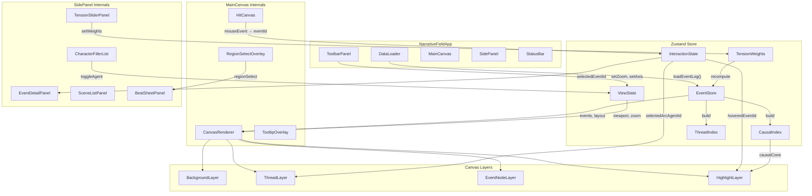

# Renderer Architecture Specification

**Status:** FINAL (aligned with canonical events.md, agents.md, tension-pipeline.md)
**Author:** viz-architect
**Dependencies:** specs/schema/events.md (#1), specs/metrics/tension-pipeline.md (#13)
**Consumers:** Phase 1 coding agent, specs/integration/data-flow.md (#17)
**Cross-references:** doc3.md Decisions 1, 2, 11, 12, 15, 16

---

## 1. Tech Recommendation: D3.js (2D-First, Canvas Primary)

### Decision

**Use D3.js with HTML Canvas rendering (not SVG) as the primary renderer.** React manages the component tree, state, and UI chrome. D3 handles the data-driven layout computation and canvas drawing. Optional Three.js/React Three Fiber for a future 3D tension-surface mode (not MVP).

### Justification

| Criterion | D3.js + Canvas | React Three Fiber (3D-first) | Hybrid (D3 2D + R3F 3D) |
|-----------|---------------|------------------------------|--------------------------|
| **MVP alignment** | Direct match — doc3 specifies 2D thread view as primary | Over-engineered for braid/thread metaphor | Extra bundle, two rendering paradigms |
| **200 events x 6 chars** | Canvas handles 1200 draw calls at 60fps trivially | GPU overkill for this scale | N/A |
| **Hover perf (<16ms)** | O(1) lookup from precomputed neighborhoods + canvas redraw of ~200 nodes | Same, but heavier per-frame cost | N/A |
| **Animation** | `requestAnimationFrame` + D3 transitions, well-documented | Spring-based animation natural in R3F | Mixed paradigms |
| **Developer familiarity** | D3 is the standard for data viz in TypeScript | Smaller talent pool, 3D concepts required | N/A |
| **Bundle size** | ~30KB (d3-selection + d3-scale + d3-force, tree-shaken) | ~150KB+ (three.js core) | ~180KB |
| **Future 3D mode** | Add R3F later as separate view component | Already there | Already there |

**Why Canvas over SVG:** At 200 events with hover highlighting that redraws causal cones, SVG DOM manipulation becomes the bottleneck (200+ DOM nodes updating on mousemove). Canvas redraws the entire scene per frame, which at this scale is faster and avoids layout thrashing. We use an offscreen "hit canvas" for event detection (standard D3 canvas pattern).

**Why not R3F for MVP:** The doc3 creative direction (Section "Braids, Not Terrain?") recommends building the thread/braid visualization as the primary mode. This is fundamentally a 2D layout (time x character-space). 3D tension displacement is a secondary enhancement. Starting with R3F would force the team to solve camera controls, occlusion, and 3D interaction before the core product experience works. Build 2D first, prove it, add 3D later.

### Performance Budget

| Operation | Target | Method |
|-----------|--------|--------|
| Initial render (200 events) | < 100ms | Single canvas draw pass |
| Hover highlight | < 16ms (1 frame) | O(1) neighborhood lookup + targeted redraw |
| Click crystallization | < 50ms | Opacity transition on pre-grouped layers |
| Zoom level transition | < 200ms | Animated scale + detail threshold swap |
| Slider/filter change | < 50ms | Recompute visible set + full redraw |
| Thread layout (spring sim) | < 500ms | D3-force with 200 nodes, ~100 iterations |

---

## 2. Data Flow: JSON Event Log to Rendered Threads

```
┌──────────────────────────────────────────────────────────────┐
│                    DATA LOADING PIPELINE                      │
│                                                              │
│  JSON Event Log ──► Parser/Validator ──► EventStore (Zustand) │
│                                          │                    │
│                                          ├─► CausalIndex      │
│                                          │   (BFS-3 precomp)  │
│                                          │                    │
│                                          ├─► ThreadIndex      │
│                                          │   (agent timelines) │
│                                          │                    │
│                                          ├─► SceneIndex       │
│                                          │   (scene groups)    │
│                                          │                    │
│                                          └─► MetricsIndex     │
│                                              (tension vectors) │
│                                                              │
│  MetricsOverlay ──► TensionComputer (client-side weighting)   │
│  (raw sub-metrics)                                           │
└──────────────────────────────────────────────────────────────┘

┌──────────────────────────────────────────────────────────────┐
│                   LAYOUT COMPUTATION                          │
│                                                              │
│  EventStore ──► AxisMapper (x-position from sim_time)         │
│             ──► ThreadLayoutEngine (y-position spring sim)     │
│             ──► Visual encoding (size, color, glow from       │
│                 tension/irony/thematic values)                │
│                                                              │
│  Output: RenderedEvent[] with { x, y, radius, color,         │
│          opacity, glowIntensity, threadId }                  │
└──────────────────────────────────────────────────────────────┘

┌──────────────────────────────────────────────────────────────┐
│                   CANVAS RENDERING                            │
│                                                              │
│  RenderedEvent[] ──► LayerManager                             │
│                      ├─► Background layer (scene boundaries,  │
│                      │   tension heatmap)                     │
│                      ├─► Thread layer (character path splines) │
│                      ├─► Event layer (nodes/dots)             │
│                      ├─► Highlight layer (causal cones)       │
│                      └─► UI overlay layer (tooltips, labels)  │
│                                                              │
│  Hit Canvas ──► Mouse event → event_id lookup → interaction   │
└──────────────────────────────────────────────────────────────┘
```

### Data Loading Steps

1. **Parse:** Load JSON event log. Validate against Event schema. Build typed array.
2. **Index:** Build lookup indices (by event_id, by agent, by location, by scene).
3. **Precompute causal neighborhoods:** BFS-3 forward and backward from each event's `causal_links`. Store as `Map<string, { backward: Set<string>, forward: Set<string> }>`. Per Decision 15 in doc3.
4. **Compute client-side tension:** If raw sub-metric vectors are provided, apply current `TensionWeights` to produce final tension values. This enables real-time slider tuning without backend round-trips.
5. **Run thread layout:** Spring-force simulation to compute Y positions (see thread-layout.md).
6. **Render:** Draw all layers to canvas.

---

## 3. State Management: Zustand

### Why Zustand

- Minimal boilerplate compared to Redux
- Works with React concurrent mode
- Supports selectors (components re-render only when their slice changes)
- No context provider needed (avoids re-render cascading)
- ~1KB bundle size

### Store Slices

```typescript
// ============================================================
// STORE DEFINITION
// ============================================================

interface NarrativeFieldStore {
  // --- Data Layer ---
  events: Event[];
  scenes: Scene[];
  causalIndex: CausalIndex;         // precomputed BFS-3 neighborhoods
  threadIndex: ThreadIndex;         // agent_id -> event_id[] (ordered)

  // --- Metrics Layer ---
  tensionWeights: TensionWeights;   // user-tunable sliders
  computedTension: Map<string, number>;  // event_id -> weighted tension

  // --- View State ---
  viewport: ViewportState;          // pan, zoom, dimensions
  zoomLevel: ZoomLevel;             // "cloud" | "threads" | "detail"
  axisConfig: AxisConfig;           // x-axis mapping (sim_time default)

  // --- Interaction State ---
  hoveredEventId: string | null;
  selectedEventId: string | null;
  selectedArcAgentId: string | null;  // crystallized character
  activeFilters: FilterState;

  // --- Selection State ---
  regionSelection: RegionSelection | null;  // drag-to-select time range

  // --- Layout Cache ---
  renderedEvents: RenderedEvent[];   // computed positions + visual props
  threadPaths: ThreadPath[];         // spline control points per agent

  // --- Actions ---
  loadEventLog: (json: string) => void;
  setTensionWeights: (weights: Partial<TensionWeights>) => void;
  setHoveredEvent: (id: string | null) => void;
  selectEvent: (id: string | null) => void;
  selectArc: (agentId: string | null) => void;
  setZoom: (level: ZoomLevel) => void;
  setViewport: (viewport: Partial<ViewportState>) => void;
  toggleCharacterFilter: (agentId: string) => void;
  setRegionSelection: (region: RegionSelection | null) => void;
  setAxisConfig: (config: AxisConfig) => void;
}
```

### Derived State (Computed via Selectors)

```typescript
// Selectors recompute only when dependencies change

// Visible events after applying filters
const useVisibleEvents = () => useStore(
  (s) => s.events.filter(e =>
    s.activeFilters.visibleAgents.has(e.source_agent) &&
    isInViewport(e, s.viewport)
  )
);

// Highlighted events (causal cone of hovered event)
const useHighlightedEvents = () => useStore(
  (s) => s.hoveredEventId
    ? s.causalIndex.get(s.hoveredEventId)
    : null
);

// Crystallized arc events (selected character's timeline)
const useCrystallizedArc = () => useStore(
  (s) => s.selectedArcAgentId
    ? s.threadIndex.get(s.selectedArcAgentId)
    : null
);
```

---

## 4. TypeScript Interfaces (Preliminary — Pending events.md)

These interfaces represent the frontend's view of the data. They will be updated to match the canonical schema from events.md once finalized. Derived from doc3.md Python dataclasses.

```typescript
// ============================================================
// EVENT TYPES (from schema — to be finalized)
// ============================================================

type EventType =
  | "chat" | "observe" | "social_move" | "reveal" | "conflict"
  | "internal" | "physical" | "confide" | "lie" | "catastrophe";

type BeatType =
  | "setup" | "complication" | "escalation" | "turning_point" | "consequence";

type DeltaKind =
  | "agent_emotion" | "agent_resource" | "agent_location" | "relationship"
  | "belief" | "secret_state" | "world_resource" | "commitment" | "pacing";

type DeltaOp = "set" | "add";

interface StateDelta {
  kind: DeltaKind;
  agent: string;
  agent_b?: string;
  attribute: string;
  op: DeltaOp;
  value: number | string | boolean;
  reason_code: string;
  reason_display: string;
}

interface EventMetrics {
  tension: number;           // [0.0, 1.0] weighted composite
  irony: number;             // [0.0, +inf) sum of irony scores for agents present
  significance: number;      // [0.0, 1.0] counterfactual impact (0.0 = not yet computed)
  thematic_shift: Record<string, number>;  // axis_name -> delta
  // Raw sub-metrics for client-side tension recomputation (per tension-pipeline.md)
  tension_components: TensionComponents;
}

interface TensionComponents {
  danger: number;                    // [0.0, 1.0]
  time_pressure: number;             // [0.0, 1.0]
  goal_frustration: number;          // [0.0, 1.0]
  relationship_volatility: number;   // [0.0, 1.0]
  information_gap: number;           // [0.0, 1.0]
  resource_scarcity: number;         // [0.0, 1.0]
  moral_cost: number;                // [0.0, 1.0]
  irony_density: number;             // [0.0, 1.0]
}

interface Event {
  id: string;
  sim_time: number;
  tick_id: number;
  order_in_tick: number;
  type: EventType;
  source_agent: string;
  target_agents: string[];
  location_id: string;
  causal_links: string[];       // IDs of causal parent events
  deltas: StateDelta[];
  description: string;
  dialogue?: string | null;          // Actual spoken words (for tooltips / story extraction)
  beat_type?: BeatType | null;
  metrics: EventMetrics;
}

interface Scene {
  id: string;
  event_ids: string[];
  location: string;
  participants: string[];
  time_start: number;
  time_end: number;
  tension_arc: number[];
  dominant_theme: string;
  scene_type: string;
}

// ============================================================
// VISUALIZATION-SPECIFIC TYPES
// ============================================================

interface TensionWeights {
  danger: number;
  time_pressure: number;
  goal_frustration: number;
  relationship_volatility: number;
  information_gap: number;
  resource_scarcity: number;
  moral_cost: number;
  irony_density: number;
}

interface AxisConfig {
  mode: "sim_time" | "scene_index" | "reveal_order" | "reader_knowledge" | "custom";
  label: string;
  mapper: (event: Event) => number;
}

type ZoomLevel = "cloud" | "threads" | "detail";

interface ViewportState {
  x: number;           // left edge in data coordinates
  y: number;           // top edge
  width: number;       // visible range in data coordinates
  height: number;
  pixelWidth: number;  // canvas pixel dimensions
  pixelHeight: number;
  scale: number;       // current zoom scale factor
}

interface FilterState {
  visibleAgents: Set<string>;
  eventTypeFilter: Set<EventType>;
  minTension: number;            // hide events below this tension
  timeRange: [number, number];   // visible time window
}

interface RegionSelection {
  timeStart: number;
  timeEnd: number;
  agentIds: string[];    // agents whose threads pass through region
}

// ============================================================
// LAYOUT OUTPUT TYPES
// ============================================================

interface RenderedEvent {
  eventId: string;
  x: number;              // canvas x position (pixels)
  y: number;              // canvas y position (pixels)
  radius: number;         // node size (scaled by significance/type)
  color: string;          // hex color (from event type or theme)
  opacity: number;        // 0-1 (dimmed if not in focus)
  glowIntensity: number;  // 0-1 (tension-driven glow)
  glowColor: string;      // hex (warm = high tension, cool = low)
  threadId: string;       // source_agent (which thread this belongs to)
  zoomVisibility: ZoomLevel;  // minimum zoom level to show this event
}

interface ThreadPath {
  agentId: string;
  agentName: string;
  color: string;              // character's signature color
  controlPoints: [number, number][];  // spline control points (x, y)
  thickness: number[];        // per-segment thickness (tension-driven)
}

interface CausalIndex {
  get(eventId: string): {
    backward: Set<string>;   // events in BFS-3 backward cone
    forward: Set<string>;    // events in BFS-3 forward cone
  } | undefined;
}

interface ThreadIndex {
  get(agentId: string): string[];  // ordered event_ids for this agent
  agents(): string[];               // all agent IDs
}
```

---

## 5. React Component Tree

```
NarrativeFieldApp
├── DataLoader                          # Parses JSON, populates store
├── ToolbarPanel                        # Top bar
│   ├── ZoomControls                    # Cloud / Threads / Detail buttons
│   ├── AxisSelector                    # X-axis mode dropdown (per Decision 12)
│   └── ExportButton                    # Region → beat sheet export
├── MainCanvas                          # The core visualization
│   ├── CanvasRenderer                  # D3 + Canvas drawing engine
│   │   ├── BackgroundLayer             # Scene boundaries, tension heatmap
│   │   ├── ThreadLayer                 # Character path splines
│   │   ├── EventNodeLayer              # Event dots/glyphs
│   │   └── HighlightLayer              # Causal cone overlay
│   ├── HitCanvas                       # Offscreen canvas for mouse detection
│   ├── TooltipOverlay                  # HTML tooltip (positioned over canvas)
│   └── RegionSelectOverlay             # Drag-to-select rectangle (HTML)
├── SidePanel                           # Right sidebar
│   ├── CharacterFilterList             # Toggle characters on/off
│   │   └── CharacterToggle             # Per-character row with color swatch
│   ├── TensionSliderPanel              # Weight sliders for tension sub-metrics
│   │   └── TensionSlider               # Individual metric weight slider
│   ├── EventDetailPanel                # Shows details of selected event
│   │   ├── EventHeader                 # Type, time, participants
│   │   ├── DeltaList                   # State changes from this event
│   │   └── CausalChainView             # Visual list of causal parents/children
│   ├── SceneListPanel                  # Scene sidebar (per Decision 16)
│   │   └── SceneCard                   # Individual scene summary
│   └── BeatSheetPanel                  # Exported beat sheet from region select
│       └── BeatEntry                   # Individual beat in the sheet
└── StatusBar                           # Bottom bar: event count, time range, zoom %
```

### Component Diagram (Mermaid)



---

## 6. Component Props Interfaces

```typescript
// ============================================================
// TOP-LEVEL
// ============================================================

interface NarrativeFieldAppProps {
  /** URL or inline JSON of the event log */
  eventLogSource: string | Event[];
  /** Optional initial tension preset */
  tensionPreset?: "default" | "thriller" | "relationship_drama" | "mystery";
  /** Optional theme/color scheme */
  theme?: "dark" | "light";
}

// ============================================================
// DATA LOADER
// ============================================================

interface DataLoaderProps {
  source: string | Event[];
  onLoaded: () => void;
  onError: (error: Error) => void;
}

// ============================================================
// TOOLBAR
// ============================================================

interface ZoomControlsProps {
  currentLevel: ZoomLevel;
  onChange: (level: ZoomLevel) => void;
}

interface AxisSelectorProps {
  currentMode: AxisConfig["mode"];
  onChange: (mode: AxisConfig["mode"]) => void;
}

interface ExportButtonProps {
  regionSelection: RegionSelection | null;
  onExport: (selection: RegionSelection) => void;
  disabled: boolean;
}

// ============================================================
// MAIN CANVAS
// ============================================================

interface MainCanvasProps {
  width: number;
  height: number;
}

interface CanvasRendererProps {
  canvasRef: React.RefObject<HTMLCanvasElement>;
  renderedEvents: RenderedEvent[];
  threadPaths: ThreadPath[];
  scenes: Scene[];
  viewport: ViewportState;
  zoomLevel: ZoomLevel;
  highlightSet: Set<string> | null;       // event IDs in causal cone
  crystallizedAgent: string | null;
  regionSelection: RegionSelection | null;
}

interface TooltipOverlayProps {
  event: Event | null;
  position: { x: number; y: number };
  visible: boolean;
}

// ============================================================
// SIDE PANEL
// ============================================================

interface CharacterFilterListProps {
  agents: AgentSummary[];
  visibleAgents: Set<string>;
  onToggle: (agentId: string) => void;
}

interface AgentSummary {
  id: string;
  name: string;
  color: string;
  eventCount: number;
}

interface CharacterToggleProps {
  agent: AgentSummary;
  visible: boolean;
  onToggle: () => void;
}

interface TensionSliderPanelProps {
  weights: TensionWeights;
  onChange: (weights: Partial<TensionWeights>) => void;
  onPresetSelect: (preset: string) => void;
}

interface TensionSliderProps {
  label: string;
  value: number;
  min: number;
  max: number;
  step: number;
  onChange: (value: number) => void;
}

interface EventDetailPanelProps {
  event: Event | null;
  onNavigateToCausal: (eventId: string) => void;
}

interface DeltaListProps {
  deltas: StateDelta[];
}

interface CausalChainViewProps {
  eventId: string;
  causalIndex: CausalIndex;
  onNavigate: (eventId: string) => void;
}

interface SceneListPanelProps {
  scenes: Scene[];
  currentSceneId: string | null;
  onSceneSelect: (sceneId: string) => void;
}

interface SceneCardProps {
  scene: Scene;
  isActive: boolean;
  onClick: () => void;
}

interface BeatSheetPanelProps {
  beats: BeatEntry[] | null;
  onClose: () => void;
}

interface BeatEntry {
  eventId: string;
  beatType: BeatType;
  description: string;
  tension: number;
  timePosition: number;
}
```

---

## 7. Canvas Rendering Strategy

### Layer Architecture

The canvas uses a multi-layer approach. Each "layer" is a draw function that paints onto the same canvas context in order (back to front):

1. **Background Layer** — Scene boundary rectangles (alternating subtle tints), tension heatmap (Gaussian-blurred color field behind threads)
2. **Thread Layer** — Cubic Bezier splines per character, with variable thickness (tension-driven) and character-specific color
3. **Event Node Layer** — Circles at each event position. Size encodes significance. Color encodes event type. Glow encodes tension.
4. **Highlight Layer** — Semi-transparent overlay that dims non-highlighted events and brightens the causal cone on hover

### Hit Detection (Offscreen Canvas)

Standard D3 canvas pattern:
- Maintain a second, hidden canvas of identical size
- Each event node is drawn on the hit canvas with a unique color (RGB encodes event index)
- On mousemove: read the pixel color at cursor position on hit canvas → decode to event index → O(1) lookup

This avoids distance-based collision detection and works reliably at any zoom level.

### Drawing Pipeline (Per Frame)

```typescript
function drawFrame(ctx: CanvasRenderingContext2D, state: RenderState): void {
  ctx.clearRect(0, 0, state.width, state.height);

  // Apply viewport transform
  ctx.save();
  ctx.translate(-state.viewport.x * state.viewport.scale,
                -state.viewport.y * state.viewport.scale);
  ctx.scale(state.viewport.scale, state.viewport.scale);

  // 1. Background
  drawSceneBoundaries(ctx, state.scenes, state.viewport);
  drawTensionHeatmap(ctx, state.tensionField, state.viewport);

  // 2. Threads
  for (const thread of state.threadPaths) {
    drawThread(ctx, thread, state.crystallizedAgent, state.zoomLevel);
  }

  // 3. Event nodes (skip in "cloud" zoom level)
  if (state.zoomLevel !== "cloud") {
    for (const re of state.renderedEvents) {
      drawEventNode(ctx, re, state.highlightSet, state.zoomLevel);
    }
  }

  // 4. Highlight overlay
  if (state.highlightSet) {
    drawCausalConeHighlight(ctx, state.highlightSet, state.renderedEvents);
  }

  // 5. Region selection rectangle
  if (state.regionSelection) {
    drawRegionSelection(ctx, state.regionSelection);
  }

  ctx.restore();
}
```

### Event Node Visual Encoding

| Property | Encoding | Source |
|----------|----------|--------|
| Position X | Horizontal position | `axisConfig.mapper(event)` → pixel |
| Position Y | Vertical position | Thread layout engine output |
| Radius | Node size | Base 4px + `significance * 6px` (range 4-10px) |
| Fill color | Event type | Type → color map (see below) |
| Glow radius | Tension | `tension * 12px` outer glow |
| Glow color | Tension level | Low=blue(#4488cc), Mid=amber(#cc8844), High=red(#cc4444) |
| Border | Beat type | Dashed = no beat, Solid = has beat_type, Double = turning_point |
| Opacity | Focus state | 1.0 = highlighted/selected, 0.6 = neutral, 0.15 = dimmed |

### Event Type Color Palette

```typescript
const EVENT_TYPE_COLORS: Record<EventType, string> = {
  chat:         "#7BA7C9",  // soft blue — low drama
  observe:      "#9B9EA3",  // grey — passive
  social_move:  "#8CB8A0",  // soft green — movement
  reveal:       "#D4A843",  // gold — information
  conflict:     "#C95A4B",  // red — confrontation
  internal:     "#A78BBF",  // purple — private thought
  physical:     "#6B8E6B",  // dark green — action
  confide:      "#C9A0D4",  // lavender — intimacy
  lie:          "#8B6B4B",  // brown — deception
  catastrophe:  "#FF4444",  // bright red — crisis (+ special glow)
};
```

### Character Thread Colors (6 agents)

```typescript
// High-contrast palette for 6 characters, colorblind-safe (based on Wong palette)
const CHARACTER_COLORS: string[] = [
  "#E69F00",  // warm orange
  "#56B4E9",  // sky blue
  "#009E73",  // teal green
  "#F0E442",  // yellow
  "#0072B2",  // deep blue
  "#D55E00",  // vermillion
];
```

---

## 8. Precomputed Causal Index (Decision 15)

Built at data load time. For 200 events with average 2 causal links each, BFS-3 produces neighborhoods of ~8-15 events. Total index size: ~200 * 15 * 2 (forward + backward) = ~6000 entries. Negligible memory.

```typescript
function buildCausalIndex(events: Event[]): CausalIndex {
  const eventMap = new Map(events.map(e => [e.id, e]));

  // Build forward adjacency from causal_links (which point backward)
  const forwardAdj = new Map<string, Set<string>>();
  for (const event of events) {
    for (const parentId of event.causal_links) {
      if (!forwardAdj.has(parentId)) forwardAdj.set(parentId, new Set());
      forwardAdj.get(parentId)!.add(event.id);
    }
  }

  const index = new Map<string, { backward: Set<string>, forward: Set<string> }>();

  for (const event of events) {
    index.set(event.id, {
      backward: bfs(event.id, 3, (id) => eventMap.get(id)?.causal_links ?? []),
      forward:  bfs(event.id, 3, (id) => [...(forwardAdj.get(id) ?? [])]),
    });
  }

  return {
    get: (id: string) => index.get(id),
  };
}

function bfs(startId: string, maxDepth: number, neighbors: (id: string) => string[]): Set<string> {
  const visited = new Set<string>();
  const queue: [string, number][] = [[startId, 0]];

  while (queue.length > 0) {
    const [id, depth] = queue.shift()!;
    if (visited.has(id) || depth > maxDepth) continue;
    visited.add(id);
    for (const neighborId of neighbors(id)) {
      if (!visited.has(neighborId)) {
        queue.push([neighborId, depth + 1]);
      }
    }
  }

  visited.delete(startId); // don't include self
  return visited;
}
```

---

## 9. Client-Side Tension Computation

Per Decision 5 and the tension-as-tunable-lens design from doc2, the frontend receives raw sub-metric vectors and computes weighted tension in real-time. This enables responsive slider interaction without backend round-trips.

```typescript
function computeTension(components: TensionComponents, weights: TensionWeights): number {
  const raw =
    components.danger * weights.danger +
    components.time_pressure * weights.time_pressure +
    components.goal_frustration * weights.goal_frustration +
    components.relationship_volatility * weights.relationship_volatility +
    components.information_gap * weights.information_gap +
    components.resource_scarcity * weights.resource_scarcity +
    components.moral_cost * weights.moral_cost +
    components.irony_density * weights.irony_density;

  // Normalize by sum of weights to keep output in [0, 1] range
  // (assuming sub-metrics are individually normalized to [0, 1])
  const weightSum = Object.values(weights).reduce((a, b) => a + b, 0);
  return weightSum > 0 ? raw / weightSum : 0;
}

function recomputeAllTension(events: Event[], weights: TensionWeights): Map<string, number> {
  const result = new Map<string, number>();
  for (const event of events) {
    result.set(event.id, computeTension(event.metrics.tension_components, weights));
  }
  return result;
}
```

---

## 10. Zoom Level Behavior

Three discrete zoom levels with smooth animated transitions (per doc2's Cloud/Threads/Detail model).

| Level | Scale Range | What's Visible | What's Hidden |
|-------|-------------|----------------|---------------|
| **Cloud** | 0.1 - 0.4 | Tension heatmap, thread paths as thin lines, scene boundaries | Individual event nodes, labels, tooltips |
| **Threads** | 0.4 - 1.5 | Thread paths with variable thickness, event nodes as dots (no labels), scene boundaries, tension glow | Detailed labels, delta lists |
| **Detail** | 1.5 - 5.0 | Everything: labeled event nodes, thread paths, causal link arrows between events, scene annotations | Nothing hidden |

Transitions between levels animate over 200ms using eased interpolation of scale and opacity thresholds.

```typescript
function getZoomLevel(scale: number): ZoomLevel {
  if (scale < 0.4) return "cloud";
  if (scale < 1.5) return "threads";
  return "detail";
}
```

---

## 11. Project File Structure

```
src/
├── App.tsx                          # Root component
├── store/
│   ├── index.ts                     # Zustand store definition
│   ├── selectors.ts                 # Derived state selectors
│   └── actions.ts                   # Store actions (load, filter, etc.)
├── data/
│   ├── parser.ts                    # JSON → typed Event[] parsing
│   ├── causal-index.ts              # BFS-3 precomputation
│   ├── thread-index.ts              # Agent timeline builder
│   └── tension-computer.ts          # Client-side weighted tension
├── layout/
│   ├── axis-mapper.ts               # X-position computation
│   ├── thread-layout.ts             # Spring-force Y-position engine
│   └── visual-encoding.ts           # Event → RenderedEvent mapping
├── canvas/
│   ├── CanvasRenderer.tsx           # Main canvas component
│   ├── HitCanvas.ts                 # Offscreen hit detection canvas
│   ├── layers/
│   │   ├── background.ts            # Scene boundaries + heatmap
│   │   ├── threads.ts               # Character spline drawing
│   │   ├── events.ts                # Event node drawing
│   │   └── highlight.ts             # Causal cone overlay
│   └── draw-utils.ts                # Shared canvas drawing helpers
├── components/
│   ├── ToolbarPanel.tsx
│   ├── SidePanel.tsx
│   ├── CharacterFilterList.tsx
│   ├── TensionSliderPanel.tsx
│   ├── EventDetailPanel.tsx
│   ├── SceneListPanel.tsx
│   ├── BeatSheetPanel.tsx
│   ├── TooltipOverlay.tsx
│   ├── RegionSelectOverlay.tsx
│   └── StatusBar.tsx
├── types/
│   ├── events.ts                    # Event, StateDelta, Scene types
│   ├── visualization.ts             # RenderedEvent, ThreadPath, etc.
│   └── store.ts                     # Store state types
├── constants/
│   ├── colors.ts                    # Color palettes
│   ├── defaults.ts                  # Default weights, zoom thresholds
│   └── presets.ts                   # Tension weight presets
└── utils/
    ├── geometry.ts                  # Point-in-rect, spline math
    └── color.ts                     # Color interpolation helpers
```

---

## 12. NOT in Scope (MVP Phase 1)

- **3D tension surface mode** — Future enhancement. The architecture supports adding an R3F-based 3D view component without restructuring.
- **Drag-to-resimulate** — Requires simulation backend (Phase 2+). The region select UI exists but exports to beat sheet only.
- **Counterfactual impact visualization** — Requires branch simulation (Phase 5). The significance metric placeholder exists.
- **Story query interface** — Phase 6. No NL search bar in Phase 1.
- **Real-time simulation streaming** — Phase 1 loads a static JSON event log. Live streaming from sim is Phase 2.
- **Collaborative/multi-user** — Phase 4+ product feature.
- **Undo/redo** — Not needed for read-only visualization of static data.
- **Accessibility** — Important but deferred. The canvas-based approach requires extra work for screen readers (ARIA descriptions of visible state). Should be addressed before public release.

---

## 13. Resolved Questions (From Dependencies)

1. **Causal neighborhood delivery:** RESOLVED. The JSON event log includes `causal_links` per event (events.md Section 7). **Frontend computes BFS-3 neighborhoods at load time** using `buildCausalIndex()`. This is fast (~5ms for 200 events).

2. **Metrics delivery format:** RESOLVED. Per tension-pipeline.md Section 4, the metrics pipeline embeds `tension_components` (8 sub-metric values) in `event.metrics.tension_components`. **The frontend receives pre-computed sub-metric values and applies `TensionWeights` client-side** for real-time slider tuning. The composite `tension` value is also provided for default display.

3. **Scene data source:** Scenes are computed by the scene segmentation pipeline (specs/metrics/scene-segmentation.md). **They arrive as a separate array in the JSON payload**, not embedded in individual events. The renderer receives `Scene[]` alongside `Event[]`.

4. **Agent metadata:** RESOLVED. Per agents.md, each `AgentState` includes `id`, `name`, and full state. **The JSON payload includes an agent manifest** alongside the event array. Color assignment follows the `CHARACTER_COLORS` palette in order of agent appearance.

### Remaining Open Question

5. **JSON payload top-level shape:** The exact top-level structure of the file the renderer loads. Proposed shape (to be confirmed in `specs/integration/data-flow.md` #17):

```typescript
interface NarrativeFieldPayload {
  agents: AgentManifest[];     // id, name, initial location
  locations: Location[];       // from world.md
  secrets: Secret[];           // from world.md
  events: Event[];             // the full event log with metrics
  scenes: Scene[];             // from scene segmentation
}

interface AgentManifest {
  id: string;
  name: string;
  initial_location: string;
}
```
